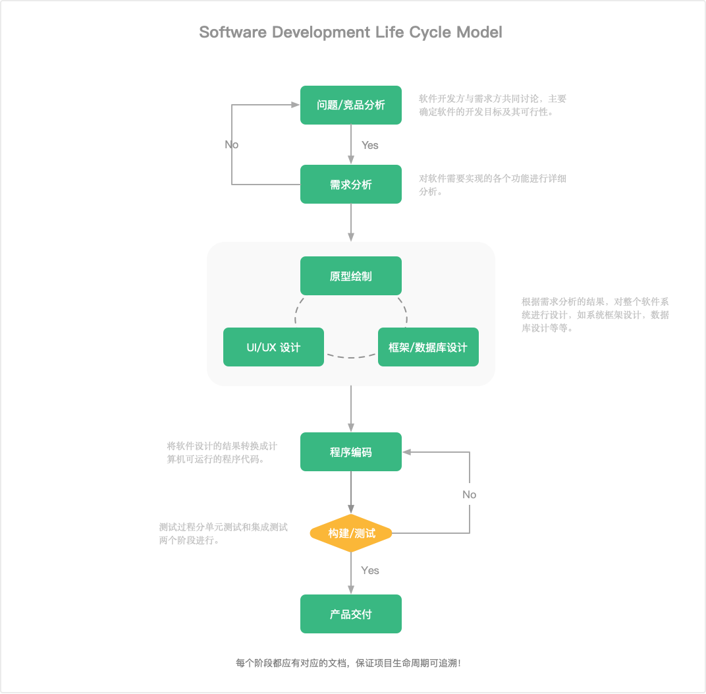

# Software Development Life Cycle



## Features

* Project managerment
* Version control
* Cooperation
* Environment managerment
* Web Hook
* Document managerment
* Flow
* Issue
* Database Scheme managerment
* Response status code managerment

## About the version
Version format：A.B.C

* A : Major version number, when there are major changes in functional modules, such as adding more modules or changes in the overall architecture.
* B : Subversion number, when there is a certain increase or change in the function, such as adding the right to control, add custom view and other functions.
* C : Phase version number, usually Bug fix or some small changes, to often release a revised version, the time interval is not limited, fix a serious Bug can be released a revised version.

## Installation

```shell
# Clone this project to your computer
git clone https://github.com/betterde/sdlc.git && cd sdlc

# Install back-end dependencies
composer install

# Install front-end dependencies
yarn or npm install

# Compile the front-end code
yarn prod or npm run prod

# Set the application key
php artisan key:generate

# Create a data table
php artisan migrate

# Fill in the initial data
php artisan db:seed
```

## Optimizing

```shell
php artisan optimize

php artisan config:cache

php artisan route:cache
```

## License
SDLC is open-sourced software licensed under the MIT license
